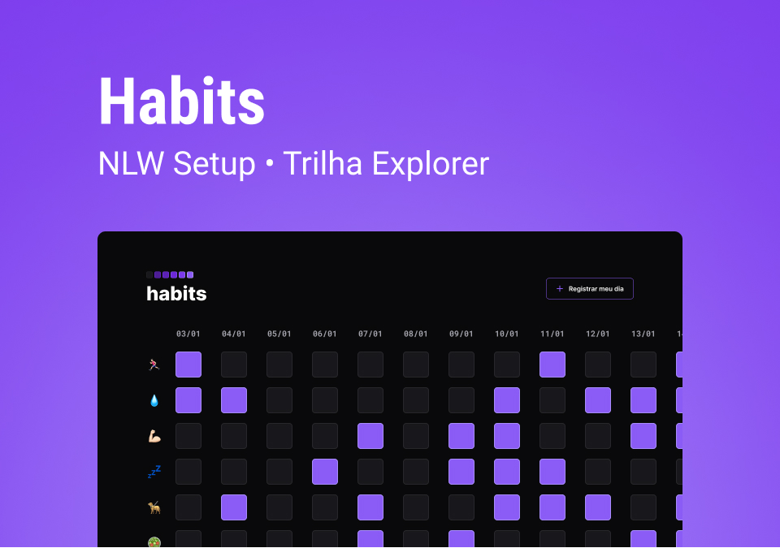

<h1 align="center"> HABITS TRACKER </h1>

  

    <a href="#-about-me">About me</a>&nbsp;&nbsp;&nbsp;|&nbsp;&nbsp;&nbsp;
    <a href="#-about-the-project">About the project</a>&nbsp;&nbsp;&nbsp;|&nbsp;&nbsp;&nbsp;
    <a href="#-technologies-and-tools">Technologies and tools</a>&nbsp;&nbsp;&nbsp;|&nbsp;&nbsp;&nbsp;
    <a href="#layout">Layout</a>

    Clique <a href="./readme-pt.md">aqui</a> para ler este README em PT-BR.

## About me

👋 Hi! I'm Bryan! Nice to meet you. I'm learning about front-end web development and am a Biochemical Engineer by educational background. If you want to see what I've been studying, check out my [study repository](https://github.com/bryrrea/study).

## About the project

The Habits Tracker is a front-end web project to help people track their day-to-day habits.

## Technologies and tools

    
    
    
    
    
    

## Layout

You can check out the project layout [here](https://www.figma.com/community/file/1195327109778210238). However, you need to have an account on [Figma](https://figma.com).
