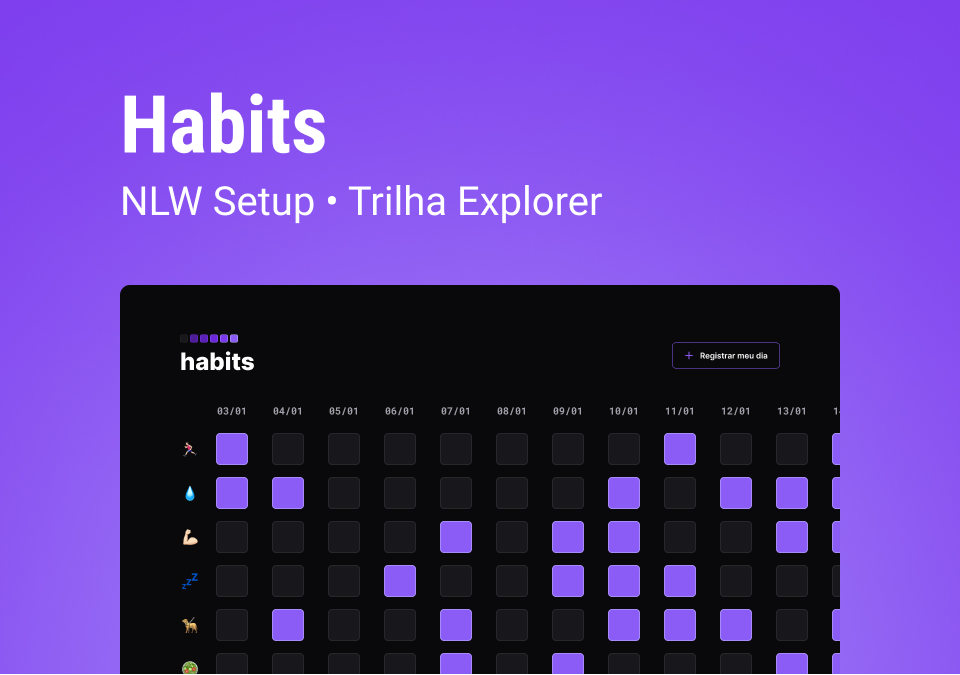

<h1 align="center"> MONITOR DE HÁBITOS </h1>

  

    <a href="#sobre-mim">Sobre mim</a>&nbsp;&nbsp;&nbsp;|&nbsp;&nbsp;&nbsp;
    <a href="#sobre-o-projeto">Sobre o projeto</a>&nbsp;&nbsp;&nbsp;|&nbsp;&nbsp;&nbsp;
    <a href="#ferramentas-e-tecnologias">Ferramentas e tecnologias</a>&nbsp;&nbsp;&nbsp;|&nbsp;&nbsp;&nbsp;
    <a href="#layout">Layout</a>

## Sobre mim

👋 Olá! Eu sou o Bryan! Prazer em conhecê-@. Estou aprendendo desenvolvimento web para front-end e sou Engenheiro Bioquímico por formação. Se quiser dar uma olhada no que estou estudando, visite meu [repositório de estudo](https://github.com/bryrrea/study).

## Sobre o projeto

O Monitor de Hábitos é um projeto web front-end para ajudar as pessoas no monitoramento de seus hábitos no dia-a-dia.

## Ferramentas e tecnologias

    
    
    
    
    
    

## Layout

Você pode dar uma olhada no layout [aqui](https://www.figma.com/community/file/1195327109778210238). Contudo, você precisa ter uma conta no [Figma](https://figma.com).

**Verifique o projeto rodando [aqui](https://bryrrea.github.io/nlwSetup-explorer/)!**
